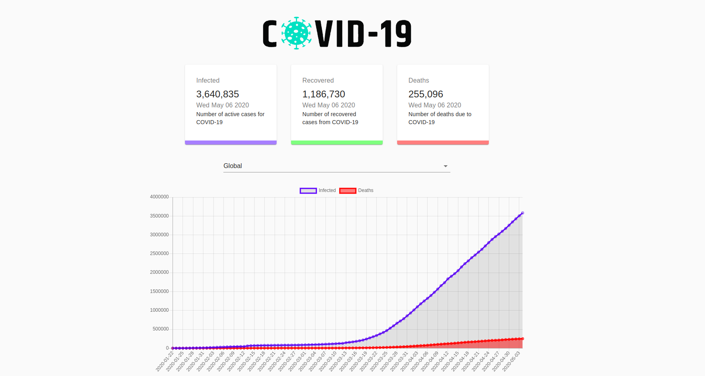

# Corona-Tracker
A web application designed using Material UI, Reactjs, Chartjs and Axios




## Installation
```
git clone https://github.com/Anishgoofle/coronatracker
npm install
npm start
```
## API used
```
https://covid19.mathdro.id/api
```
